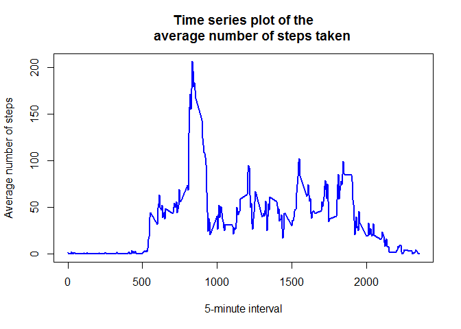

# Loading and preprocessing the data


```r
knitr::opts_chunk$set(fig.path = "figures/")
path <- "C:/Users/dell/Desktop/activity.csv"
data <- read.csv(path, sep = ",", na.strings = "NA")
```

# What is mean total number of steps taken per day?

## Calculate the total number of steps taken per day


```r
library(dplyr)
```

```
## 
## Attachement du package : 'dplyr'
```

```
## Les objets suivants sont masqués depuis 'package:stats':
## 
##     filter, lag
```

```
## Les objets suivants sont masqués depuis 'package:base':
## 
##     intersect, setdiff, setequal, union
```

```r
TS <- 
  data %>% 
  group_by(date) %>% 
  summarise(
    total_steps = sum(steps, na.rm = TRUE)
  )
```

## Make a histogram of the total number of steps taken each day


```r
p1 <- plot(as.Date(TS$date), TS$total_steps, main = "Daily total steps", xlab = "Date", 
    ylab = "Total Steps",  type = "h", col="red")
```

<!-- -->

## Mean of the total number of steps taken per day


```r
mean(TS$total_steps)
```

```
## [1] 9354.23
```

## Median of the total number of steps taken per day


```r
median(TS$total_steps)
```

```
## [1] 10395
```

# Average daily activity pattern


```r
library(dplyr)
AVRG <- 
  data %>% 
  group_by(interval) %>% 
  summarise(
    Average_steps = mean(steps, na.rm = TRUE)
  )
```

## Time series plot of the 5-minute interval (x-axis) and the average number of steps taken, averaged across all days (y-axis)


```r
plot(AVRG$interval, AVRG$Average_steps, main = "Time series plot of the
     average number of steps taken", xlab="5-minute interval", 
     ylab = "Average number of steps", type="l", col="blue", lwd=2)
```

<!-- -->

## 5-minute interval, on average across all the days in the dataset, that contains the maximum number of steps


```r
as.numeric(AVRG[which.max(AVRG$Average_steps), 1])
```

```
## [1] 835
```

# Imputing missing values

## Total number of missing values in the dataset


```r
sum(is.na(data))
```

```
## [1] 2304
```

## Filling in all of the missing values in the dataset


```r
data$steps[is.na(data$steps)]<-AVRG$Average_steps
head(data)
```

```
##       steps       date interval
## 1 1.7169811 2012-10-01        0
## 2 0.3396226 2012-10-01        5
## 3 0.1320755 2012-10-01       10
## 4 0.1509434 2012-10-01       15
## 5 0.0754717 2012-10-01       20
## 6 2.0943396 2012-10-01       25
```

## Histogram of the total number of steps taken each day


```r
TS_no_NAS <- 
  data %>% 
  group_by(date) %>% 
  summarise(
    total_steps = sum(steps, na.rm = TRUE)
  )
p2 <- plot(as.Date(TS_no_NAS$date), TS_no_NAS$total_steps, main = "Daily total steps", xlab = "Date", ylab = "Total Steps",  type = "h", col="red")
```

<!-- -->

## Mean steps


```r
mean(TS_no_NAS$total_steps)
```

```
## [1] 10766.19
```

## Median steps


```r
median(TS_no_NAS$total_steps)
```

```
## [1] 10766.19
```

## Impact of imputing missing data on the estimates of the total daily number of steps

Only a slight difference can be observed.

# Differences in activity patterns between weekdays and weekends

## Create a new factor variable in the dataset with two levels -- "weekday" and "weekend" indicating whether a given date is a weekday or weekend day.


```r
days <- weekdays(as.Date(data$date), abbreviate = TRUE)
data$days <- days
head(data)
```

```
##       steps       date interval days
## 1 1.7169811 2012-10-01        0 lun.
## 2 0.3396226 2012-10-01        5 lun.
## 3 0.1320755 2012-10-01       10 lun.
## 4 0.1509434 2012-10-01       15 lun.
## 5 0.0754717 2012-10-01       20 lun.
## 6 2.0943396 2012-10-01       25 lun.
```

```r
library(dplyr)
data <- 
  data %>%
  mutate(day_type= case_when(
      days %in% c("sam.", "dim.") ~ "weekend"
    , TRUE ~ "weekday"
  ))
head(data)
```

```
##       steps       date interval days day_type
## 1 1.7169811 2012-10-01        0 lun.  weekday
## 2 0.3396226 2012-10-01        5 lun.  weekday
## 3 0.1320755 2012-10-01       10 lun.  weekday
## 4 0.1509434 2012-10-01       15 lun.  weekday
## 5 0.0754717 2012-10-01       20 lun.  weekday
## 6 2.0943396 2012-10-01       25 lun.  weekday
```

## Panel plot containing a time series plot of the 5-minute interval (x-axis) and the average number of steps taken, averaged across all weekday days or weekend days (y-axis)


```r
library(dplyr)
AVRG_day_type <- data %>%
  group_by(interval, day_type)%>%
  summarise(
  average_steps = mean(steps)
  )
library(ggplot2)
```

```
## Warning: le package 'ggplot2' a été compilé avec la version R 4.2.2
```

```r
p3 <- ggplot(AVRG_day_type, aes(x=interval, y=average_steps))+
  geom_line(color="blue")+
  labs(title = "Averge number of steps per day", x="5-min Interval", y="Average Steps")+
  theme(plot.title = element_text(hjust = 0.5)) +
  facet_wrap(~day_type)
p3
```

<!-- -->
